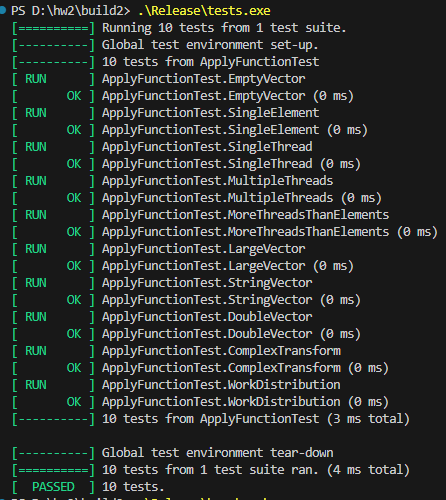
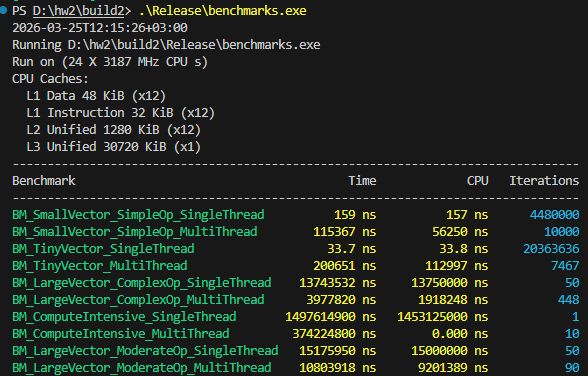

Скрины прохождения тестов и бенчмарков приложил скринами в этой папке, их можно увидеть ниже:

Тесты

Бенчмарки

Отсюда можем сделать важные выводы об эффективности работы многопоточной\однопоточной реализации на разных размерах данных:

На маленьких векторах лучше справляется ST версия, поскольку нам не нужно создавать много потоков (а их создание, очевидно, занимает определенный объем ресурсов).

Из бенчей:
BM_SmallVector_SimpleOp_SingleThread      162 ns << BM_SmallVector_SimpleOp_MultiThread    120464 ns 
BM_TinyVector_SingleThread               35.4 ns << BM_TinyVector_MultiThread              217589 ns

Ну и, соотв. , многопоточная реализация выигрывает в случае с большим объемом данных.

BM_LargeVector_ComplexOp_SingleThread   14.07 ms > BM_LargeVector_ComplexOp_MultiThread     4.01 ms
BM_ComputeIntensive_SingleThread       1543 ms > BM_ComputeIntensive_MultiThread         370 ms
BM_LargeVector_ModerateOp_SingleThread  15.25 ms > BM_LargeVector_ModerateOp_MultiThread   10.92 ms

