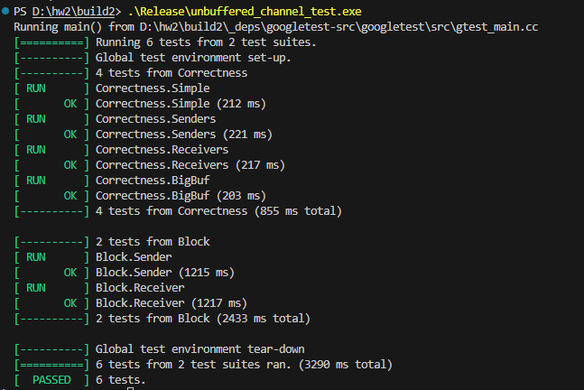
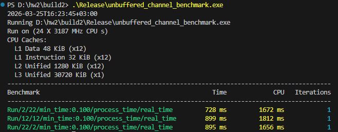

Пару раз переписывал, в итоге после финальной сборки удалось запустить тесты:

Базовые тесты

Бенчи

Внутри тестов были обработаны разные кейсы для программы, самые интересные:

Correctness.Simple (212 ms) (базовый пинг - отправка+получение)
Correctness.BigBuf (203 ms) (большой объем данных)

и др. со скрина

Теперь по бенчмаркам.

2 сендера и 22 получателя - 728 ms
12 сендеров и 12 получателей - 899 ms 
22 сендера и 2 получателя - 895 ms

Получается, что результаты не сильно расходятся на разных сценариях, следовательно от unbuf'a стоит ожидать более-менее стабильной работы.