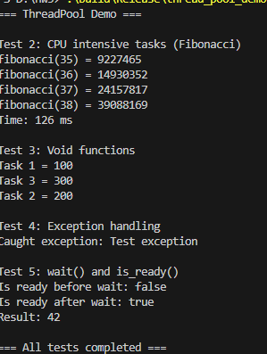
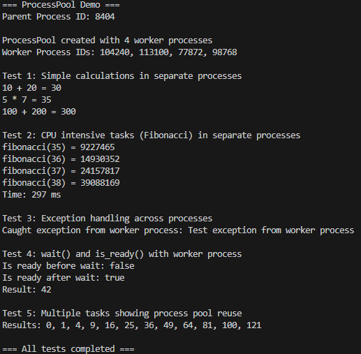

Для начала сделал базовую реализацию через многопоточность, протестировал по бейзлайну. Все работает корректно, зафиксировал время для сравнения

Многопоточность

Потом начал переписывать на +5 баллов, немного врезался в dr, но по итогу получил, вроде как, подходящую реализацию

Многопроцессность

В итоге получилось, что на второй таске время выполнения больше
